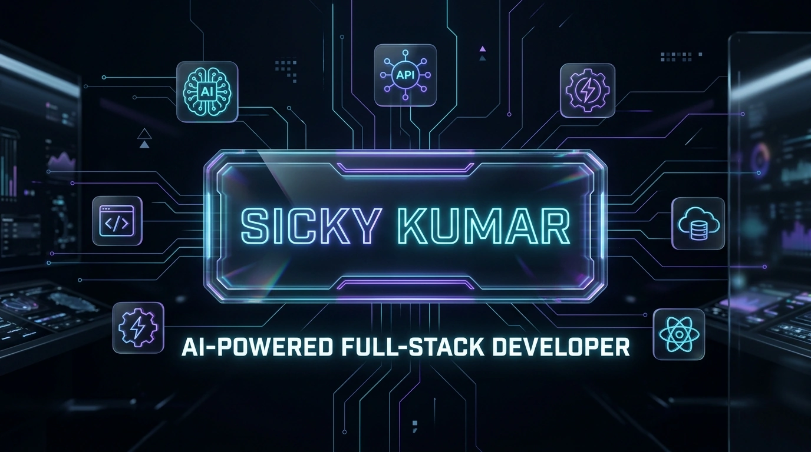
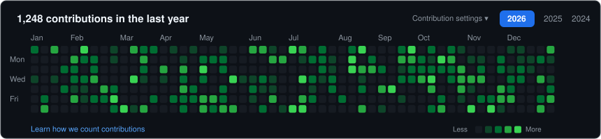
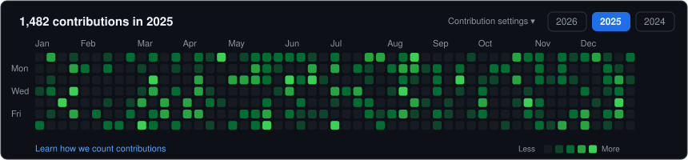
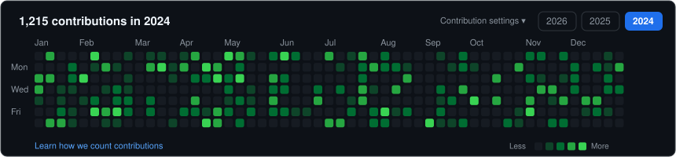
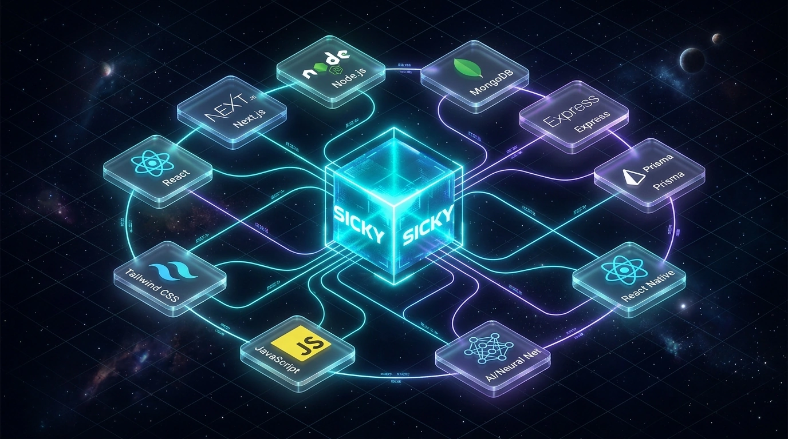
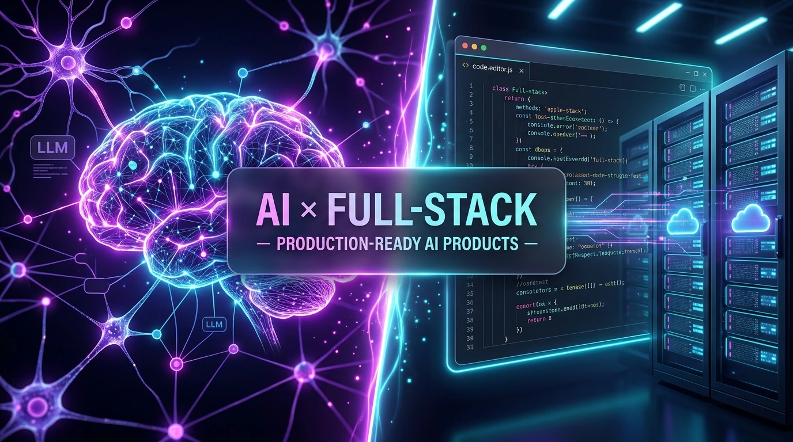

  <!-- HERO 3D BANNER -->
  

  

  <!-- GOOGLE SEO & BRAND HEADING -->
  <h1 align="center">Hi 👋, I'm <a href="https://www.sickykumar.in">Sicky Kumar</a></h1>

  <!-- RESPONSIVE ANIMATED TYPING SUBTITLE -->
  

  

    <b>Building the future, one scalable digital product at a time.</b> 
    <b>Sicky Kumar</b> (@sickykumar) — Specialized in full-stack SaaS engineering, production AI systems, scalable frontends, and cloud infrastructure.
  

  <!-- INTERACTIVE SOCIAL & FOLLOWER CTA PILLS -->
  

    
    
    
    
    
    
  

  <!-- RESPONSIVE QUICK NAVIGATION BADGES (WRAPS NATURALLY ON ALL SCREEN SIZES) -->
  

    
    
    
    
    
    
    
    
  

---

# 📊 Building in Public & Contribution Activity

  <!-- GITHUB REAL-TIME ACTIVITY & METRICS -->
  

    
    
    
    
  

  <!-- INTERACTIVE YEAR SELECTOR PILLS -->
  

    
    
    
  

  <!-- 2026 MATRIX (OPEN BY DEFAULT: JAN TO AUG) -->
  

    
<b>🟢 2026 Contribution Matrix (1,001 Contributions · Jan – Aug)</b>

     
    
  

   

  <!-- 2025 MATRIX (COLLAPSED / SWITCHABLE FULL YEAR) -->
  

    
<b>🟢 2025 Contribution Matrix (1,482 Contributions · Full Year)</b>

     
    
  

   

   

  <!-- 2024 MATRIX (COLLAPSED / SWITCHABLE FULL YEAR) -->
  

    
<b>🟢 2024 Contribution Matrix (1,215 Contributions · Full Year)</b>

     
    
  

   

  
<i>"Every commit is another step toward engineering a better digital product."</i>

---

# 🌌 3D Technology Ecosystem

  
  
<b>Autonomous Node Architecture</b> — Unified multi-stack integration with reactive frontend, robust APIs & AI core

---

# ⚡ Technology Universe

### 🎨 Frontend Engineering

  
  
  
  
  
  
  
  
  

### ⚙️ Backend & APIs

  
  
  
  
  
  

### 💾 Database & ORM

  
  
  
  

### 🤖 AI & Intelligent Systems

  
  
  
  

### 📱 Mobile & Desktop

  
  
  
  

### ☁️ Cloud & DevOps Infrastructure

  
  
  
  
  
  

---

# 🏗️ Full-Stack 3D Architecture Pipeline

  

 

> **Multi-Tier Execution Flow:**
>
> 1. **Client Tier**: React.js / Next.js (Web) · React Native / Expo (Mobile) · Electron (Desktop)
> 2. **Intelligence Tier**: Autonomous AI Agents · OpenAI & Google Gemini LLM Pipelines
> 3. **API & Service Tier**: Node.js & Express REST APIs · Microservices · JWT Auth & Rate Limiting
> 4. **Persistence Tier**: MongoDB (Document Store) · MySQL (Relational) with Prisma ORM
> 5. **Cloud Deployment**: AWS · Vercel · Render · Cloudinary Asset Optimization

---

# ⭐ Featured Builds

<table>
  <tr>
    <td width="50%" valign="top">
      <h3>🎓 <a href="https://github.com/sickykumar/e-learning-platform">e-learning-platform</a></h3>
      
<b>Full-Stack MERN SaaS Education Engine</b>

      
Complete educational platform with student/instructor portals, JWT authentication, course enrollment, progress tracking, automated certificates, payment checkout, and admin analytics.

      
<code>React</code> · <code>Node.js</code> · <code>Express</code> · <code>MongoDB</code> · <code>Tailwind</code>

      
    </td>
    <td width="50%" valign="top">
      <h3>🌾 <a href="https://github.com/sickykumar/agriconnect">agriconnect</a></h3>
      
<b>AgriTech Digital Marketplace & Hub</b>

      
Modern platform connecting farmers, distributors, and consumers through direct transparent marketplace trade, real-time demand tracking, and supply chain resource optimization.

      
<code>React</code> · <code>Node.js</code> · <code>REST APIs</code> · <code>MongoDB</code>

      
    </td>
  </tr>
  <tr>
    <td width="50%" valign="top">
      <h3>🎬 <a href="https://github.com/sickykumar/online-ott-platform">online-ott-platform</a></h3>
      
<b>High-Scale Digital Video Streaming Platform</b>

      
Rich video streaming platform featuring responsive glassmorphism UI, curated category feeds, watchlist management, optimized media delivery, and smooth video playback.

      
<code>React</code> · <code>JavaScript</code> · <code>Node.js</code> · <code>Cloudinary</code>

      
    </td>
    <td width="50%" valign="top">
      <h3>🤖 <a href="https://github.com/sickykumar/ai-powered-food-app">ai-powered-food-app</a></h3>
      
<b>Smart AI Culinary & Nutrition Intelligence</b>

      
AI-infused dining companion utilizing LLM prompts for personalized nutritional guidance, intelligent ingredient tracking, automated recipe synthesis, and dietary planning.

      
<code>React</code> · <code>OpenAI / Gemini</code> · <code>Node.js</code> · <code>REST</code>

      
    </td>
  </tr>
  <tr>
    <td width="50%" valign="top">
      <h3>📰 <a href="https://github.com/sickykumar/News-Web-Application">News-Web-Application</a></h3>
      
<b>Real-Time Live Global News Portal</b>

      
Dynamic news portal with instant category filtering, real-time live REST API consumption, multi-topic search, responsive UI, and lightning-fast article feeds.

      
<code>React.js</code> · <code>Live News API</code> · <code>JavaScript</code> · <code>Tailwind</code>

      
    </td>
    <td width="50%" valign="top">
      <h3>💼 <a href="https://github.com/sickykumar/main-portfolio">main-portfolio</a></h3>
      
<b>Interactive Flagship SaaS Developer Portfolio</b>

      
High-performance developer portfolio built with micro-interactions, responsive 3D-inspired cards, project discovery, dark mode palettes, and optimized lighthouse scores.

      
<code>React</code> · <code>Vite</code> · <code>Tailwind CSS</code> · <code>Framer Motion</code>

      
    </td>
  </tr>
</table>

---

# 🚀 My Repository Universe

> Explore all **38 public repositories** built across Web, AI, Desktop, Data Analytics, Tools, and Learning Systems.

<b>🌐 Web Applications (14 Repositories)</b>

 

| Project                                                                               | Description                                                          | Stack                       | Link                                                                    |
| :------------------------------------------------------------------------------------ | :------------------------------------------------------------------- | :-------------------------- | :---------------------------------------------------------------------- |
| 🎓 **[e-learning-platform](https://github.com/sickykumar/e-learning-platform)**       | Full-stack MERN e-learning SaaS platform with auth, payments & admin | `MERN Stack` `Tailwind`     | [**Open Repo →**](https://github.com/sickykumar/e-learning-platform)    |
| 🌾 **[agriconnect](https://github.com/sickykumar/agriconnect)**                       | Agriculture smart marketplace and ecosystem hub                      | `React` `Node.js` `REST`    | [**Open Repo →**](https://github.com/sickykumar/agriconnect)            |
| 🎬 **[online-ott-platform](https://github.com/sickykumar/online-ott-platform)**       | Video streaming OTT platform with media playback                     | `React` `Cloudinary` `Node` | [**Open Repo →**](https://github.com/sickykumar/online-ott-platform)    |
| 📰 **[News-Web-Application](https://github.com/sickykumar/News-Web-Application)**     | Live news aggregation web application with live feeds                | `React` `News API`          | [**Open Repo →**](https://github.com/sickykumar/News-Web-Application)   |
| 💼 **[main-portfolio](https://github.com/sickykumar/main-portfolio)**                 | Developer portfolio website with interactive UI                      | `React` `Vite` `Tailwind`   | [**Open Repo →**](https://github.com/sickykumar/main-portfolio)         |
| 🎨 **[react-worldArt-project](https://github.com/sickykumar/react-worldArt-project)** | Dynamic art showcase and creative gallery                            | `React` `CSS Modules`       | [**Open Repo →**](https://github.com/sickykumar/react-worldArt-project) |
| ✅ **[react-Todo-app](https://github.com/sickykumar/react-Todo-app)**                 | Task management app with persistent local storage                    | `React` `LocalStorage`      | [**Open Repo →**](https://github.com/sickykumar/react-Todo-app)         |
| 🌓 **[dark-light-mode-react](https://github.com/sickykumar/dark-light-mode-react)**   | Design token & theme toggling system in React                        | `React` `Theme Context`     | [**Open Repo →**](https://github.com/sickykumar/dark-light-mode-react)  |
| ⚡ **[pokemon-search-app](https://github.com/sickykumar/pokemon-search-app)**         | Fast Pokémon database explorer with live search                      | `JavaScript` `PokéAPI`      | [**Open Repo →**](https://github.com/sickykumar/pokemon-search-app)     |
| 🧮 **[Modern-Calculator](https://github.com/sickykumar/Modern-Calculator)**           | Glassmorphic modern calculator application                           | `JavaScript` `CSS3`         | [**Open Repo →**](https://github.com/sickykumar/Modern-Calculator)      |
| 📚 **[eduhub_web](https://github.com/sickykumar/eduhub_web)**                         | Educational resource library and student platform                    | `HTML5` `CSS3` `JS`         | [**Open Repo →**](https://github.com/sickykumar/eduhub_web)             |
| 🎨 **[gradient-color-picker](https://github.com/sickykumar/gradient-color-picker)**   | CSS gradient generator & designer color utility                      | `JavaScript` `CSS Canvas`   | [**Open Repo →**](https://github.com/sickykumar/gradient-color-picker)  |
| 🔗 **[url_shortner](https://github.com/sickykumar/url_shortner)**                     | URL shortening service with analytics                                | `Node.js` `Express` `Mongo` | [**Open Repo →**](https://github.com/sickykumar/url_shortner)           |
| 💼 **[Portfolio_With_AI](https://github.com/sickykumar/Portfolio_With_AI)**           | AI-enhanced interactive portfolio prototype                          | `React` `AI API`            | [**Open Repo →**](https://github.com/sickykumar/Portfolio_With_AI)      |

<b>🤖 AI Projects (5 Repositories)</b>

 

| Project                                                                             | Description                                                    | Stack                        | Link                                                                   |
| :---------------------------------------------------------------------------------- | :------------------------------------------------------------- | :--------------------------- | :--------------------------------------------------------------------- |
| 🍕 **[ai-powered-food-app](https://github.com/sickykumar/ai-powered-food-app)**     | AI-assisted recipe engine and intelligent food discovery       | `React` `AI API` `Node.js`   | [**Open Repo →**](https://github.com/sickykumar/ai-powered-food-app)   |
| 💬 **[Ai-Chat-Bot-Pro](https://github.com/sickykumar/Ai-Chat-Bot-Pro)**             | Advanced AI conversational assistant with context preservation | `Python` `AI / LLM` `NLP`    | [**Open Repo →**](https://github.com/sickykumar/Ai-Chat-Bot-Pro)       |
| ♊ **[ChatBot-Google-Gemini](https://github.com/sickykumar/ChatBot-Google-Gemini)** | Conversational application powered by Google Gemini API        | `Google Gemini API` `Python` | [**Open Repo →**](https://github.com/sickykumar/ChatBot-Google-Gemini) |
| 🤖 **[chatbot](https://github.com/sickykumar/chatbot)**                             | Core AI chatbot application and conversational engine          | `JavaScript` `AI Logic`      | [**Open Repo →**](https://github.com/sickykumar/chatbot)               |
| 🧠 **[Portfolio_With_AI](https://github.com/sickykumar/Portfolio_With_AI)**         | AI-powered personal portfolio interface                        | `React` `AI API` `Node`      | [**Open Repo →**](https://github.com/sickykumar/Portfolio_With_AI)     |

<b>🖥️ Desktop Applications (2 Repositories)</b>

 

| Project                                                                           | Description                                                   | Stack                            | Link                                                                  |
| :-------------------------------------------------------------------------------- | :------------------------------------------------------------ | :------------------------------- | :-------------------------------------------------------------------- |
| 🎵 **[windows-music-player](https://github.com/sickykumar/windows-music-player)** | Desktop audio player with playlists and responsive visualizer | `Electron` `React` `Desktop API` | [**Open Repo →**](https://github.com/sickykumar/windows-music-player) |
| 🎧 **[offline-music-player](https://github.com/sickykumar/offline-music-player)** | Standalone offline music jukebox with local audio indexing    | `Electron / JS` `Audio Engine`   | [**Open Repo →**](https://github.com/sickykumar/offline-music-player) |

<b>📊 Data Analytics & Dashboards (5 Repositories)</b>

 

| Project                                                                                                   | Description                                                    | Stack                          | Link                                                                              |
| :-------------------------------------------------------------------------------------------------------- | :------------------------------------------------------------- | :----------------------------- | :-------------------------------------------------------------------------------- |
| 📈 **[ALEX-ECOMMERCE-SALES-DASHBOARD](https://github.com/sickykumar/ALEX-ECOMMERCE-SALES-DASHBOARD)**     | Multi-channel e-commerce sales and revenue KPI dashboard       | `PowerBI / Excel` `Analytics`  | [**Open Repo →**](https://github.com/sickykumar/ALEX-ECOMMERCE-SALES-DASHBOARD)   |
| 🛒 **[SuperStore_Sales_Report](https://github.com/sickykumar/SuperStore_Sales_Report)**                   | Retail store sales analytics and profit distribution report    | `Business Intelligence`        | [**Open Repo →**](https://github.com/sickykumar/SuperStore_Sales_Report)          |
| 🏢 **[Sales-Dashboard-Of-ABC-Company](https://github.com/sickykumar/Sales-Dashboard-Of-ABC-Company)**     | Enterprise corporate sales performance and forecasting metrics | `Data Analytics` `Dashboards`  | [**Open Repo →**](https://github.com/sickykumar/Sales-Dashboard-Of-ABC-Company)   |
| 👥 **[HR-ANALYTICS-PROJECT](https://github.com/sickykumar/HR-ANALYTICS-PROJECT)**                         | Workforce attrition, retention, and HR performance insights    | `Analytics` `KPI Reporting`    | [**Open Repo →**](https://github.com/sickykumar/HR-ANALYTICS-PROJECT)             |
| 📺 **[Amazon-Prime-Movies-and-TV-Shows](https://github.com/sickykumar/Amazon-Prime-Movies-and-TV-Shows)** | Streaming catalog exploratory data analysis and visual trends  | `Data Analysis` `Python/Excel` | [**Open Repo →**](https://github.com/sickykumar/Amazon-Prime-Movies-and-TV-Shows) |

<b>🛠️ Backend & Developer Tools (3 Repositories)</b>

 

| Project                                                                                     | Description                                                    | Stack                      | Link                                                                       |
| :------------------------------------------------------------------------------------------ | :------------------------------------------------------------- | :------------------------- | :------------------------------------------------------------------------- |
| 📦 **[NodeJs](https://github.com/sickykumar/NodeJs)**                                       | Collection of modular Node.js backend projects & API utilities | `Node.js` `Express` `APIs` | [**Open Repo →**](https://github.com/sickykumar/NodeJs)                    |
| ⌨️ **[nodejs_cli_todo_app](https://github.com/sickykumar/nodejs_cli_todo_app)**             | Interactive terminal CLI productivity tool for task management | `Node.js CLI` `Commander`  | [**Open Repo →**](https://github.com/sickykumar/nodejs_cli_todo_app)       |
| 🏫 **[student-management-system](https://github.com/sickykumar/student-management-system)** | Academic records and student management system                 | `Full-Stack` `Database`    | [**Open Repo →**](https://github.com/sickykumar/student-management-system) |

<b>🧪 Learning, Systems & Experiments (10 Repositories)</b>

 

| Project                                                                                                                           | Description                                               | Stack                         | Link                                                                                          |
| :-------------------------------------------------------------------------------------------------------------------------------- | :-------------------------------------------------------- | :---------------------------- | :-------------------------------------------------------------------------------------------- |
| 🐍 **[Python_Tutorial](https://github.com/sickykumar/Python_Tutorial)**                                                           | Python programming tutorials from fundamentals to OOP     | `Python 3` `Algorithms`       | [**Open Repo →**](https://github.com/sickykumar/Python_Tutorial)                              |
| 🟢 **[NodeJs_Tutorial](https://github.com/sickykumar/NodeJs_Tutorial)**                                                           | Backend architecture guides and async JavaScript patterns | `Node.js` `Event Loop`        | [**Open Repo →**](https://github.com/sickykumar/NodeJs_Tutorial)                              |
| ⚡ **[DSA_With_C](https://github.com/sickykumar/DSA_With_C)**                                                                     | Data structures & algorithms implemented in low-level C   | `C Language` `Pointers` `DSA` | [**Open Repo →**](https://github.com/sickykumar/DSA_With_C)                                   |
| 🛠️ **[python_project](https://github.com/sickykumar/python_project)**                                                             | Python utility scripts for file conversions & automation  | `Python Utilities`            | [**Open Repo →**](https://github.com/sickykumar/python_project)                               |
| 🍃 **[MongoDB_With_Python](https://github.com/sickykumar/MongoDB_With_Python)**                                                   | PyMongo integration and database aggregation pipelines    | `Python` `MongoDB` `PyMongo`  | [**Open Repo →**](https://github.com/sickykumar/MongoDB_With_Python)                          |
| 📹 **[YouTube-Video-Manager-with-MongoDB-in-Python](https://github.com/sickykumar/YouTube-Video-Manager-with-MongoDB-in-Python)** | Video inventory management with Python & MongoDB CRUD     | `Python` `MongoDB` `Backend`  | [**Open Repo →**](https://github.com/sickykumar/YouTube-Video-Manager-with-MongoDB-in-Python) |
| 📇 **[Contact-Management-System-with-Python](https://github.com/sickykumar/Contact-Management-System-with-Python)**               | Relational contact registry with persistent file storage  | `Python` `File I/O`           | [**Open Repo →**](https://github.com/sickykumar/Contact-Management-System-with-Python)        |
| ☁️ **[aws-demo-app](https://github.com/sickykumar/aws-demo-app)**                                                                 | Cloud deployment architecture and AWS cloud service tests | `AWS` `Cloud Hosting`         | [**Open Repo →**](https://github.com/sickykumar/aws-demo-app)                                 |
| 🏢 **[ardent-internship](https://github.com/sickykumar/ardent-internship)**                                                       | Industry internship project and software deliverables     | `Full-Stack Development`      | [**Open Repo →**](https://github.com/sickykumar/ardent-internship)                            |
| 🌐 **[AWS-AS](https://github.com/sickykumar/AWS-AS)**                                                                             | AWS infrastructure and cloud scalability project          | `AWS` `Cloud Architecture`    | [**Open Repo →**](https://github.com/sickykumar/AWS-AS)                                       |

   
  

---

# 🧠 What I Build

<table>
  <tr>
    <td width="33%" valign="top">
      <h3>🚀 SaaS Platforms</h3>
      
Scalable, subscription-based applications with automated workflows, role-based authentication, and modern user experiences.

    </td>
    <td width="33%" valign="top">
      <h3>🤖 AI Applications</h3>
      
Intelligent software powered by OpenAI & Gemini APIs, LLM prompt engineering, autonomous agents, and contextual AI workflows.

    </td>
    <td width="33%" valign="top">
      <h3>🌐 Web Applications</h3>
      
High-performance, reactive full-stack web applications using React, Next.js, Vite, and production-grade MERN architectures.

    </td>
  </tr>
  <tr>
    <td width="33%" valign="top">
      <h3>📱 Mobile Apps</h3>
      
Cross-platform mobile applications engineered with React Native, Expo, and Expo Router for iOS and Android.

    </td>
    <td width="33%" valign="top">
      <h3>🛠️ Developer Tools</h3>
      
CLI utilities, reusable component libraries, starter scaffolds, and developer systems that boost engineering productivity.

    </td>
    <td width="33%" valign="top">
      <h3>📊 Business Platforms</h3>
      
Enterprise analytics dashboards, LMS platforms, e-commerce engines, and data reporting command centers.

    </td>
  </tr>
</table>

---

# 🤖 AI × Full-Stack Convergence

  

 

> **The Modern Production Formula:**
> `Modern UI` + `Scalable APIs` + `Database Architecture` + `AI Integrations` + `Cloud DevOps` = **Production-Ready AI Products**
>
> **Bridging frontier AI capabilities and bulletproof full-stack execution.**
> I combine reactive frontend architectures and robust backend APIs with LLM integrations to turn complex AI ideas into intuitive, production-grade SaaS products.

---

# 📱 Mobile Engineering

<table>
  <tr>
    <td width="60%" valign="top">
      <h3>React Native + Expo Ecosystem</h3>
      
Mobile applications shouldn't be an afterthought. I engineer native cross-platform experiences that share business logic with web clients while respecting mobile design paradigms.

      <ul>
        <li><b>Expo & Expo Router:</b> File-based native routing and deep linking</li>
        <li><b>State Synchronization:</b> Shared caching with TanStack Query and Redux</li>
        <li><b>Responsive Mobile UI:</b> Fluid layouts with Tailwind / NativeWind</li>
        <li><b>Secure Storage:</b> Biometrics, secure keychain auth, and offline mode</li>
      </ul>
    </td>
    <td width="40%" align="center" valign="middle">
        
        
      
    </td>
  </tr>
</table>

---

# 💎 Engineering Principles

<table>
  <tr>
    <td width="33%" valign="top">
      <h4><code>01</code> System Architecture</h4>
      
Build modular, loosely-coupled systems designed to adapt and scale as product requirements evolve.

    </td>
    <td width="33%" valign="top">
      <h4><code>02</code> Extreme Performance</h4>
      
Optimize frontend rendering, minimize API latency, and craft efficient database queries with indexing.

    </td>
    <td width="33%" valign="top">
      <h4><code>03</code> Bulletproof Security</h4>
      
End-to-end data validation, JWT authentication, role authorization, and sanitized API endpoints.

    </td>
  </tr>
  <tr>
    <td width="33%" valign="top">
      <h4><code>04</code> High Scalability</h4>
      
Architect state layers, microservices, and databases for rapid growth without technical debt.

    </td>
    <td width="33%" valign="top">
      <h4><code>05</code> Intuitive UX</h4>
      
Transform complicated backend workflows and AI pipelines into effortless, delightful user interfaces.

    </td>
    <td width="33%" valign="top">
      <h4><code>06</code> Value-Driven AI</h4>
      
Integrate AI where it genuinely improves user speed, automation, and core product metrics.

    </td>
  </tr>
</table>

---

# 🔭 Currently Exploring & Expanding

  

    
    
    
    
    
    
  

---

# ⚡ Personal Identity

  

    
    
  

  <h3>Developer · Builder · Problem Solver</h3>
  
<b>Full-Stack · AI-Powered · Product-Focused</b>

   

  

    
    
  

---

# ✨ Have a Vision or Project?

### **Let's build something remarkable together.**

  

    Whether you are looking to hire a full-stack engineer, build an AI SaaS product, or collaborate on innovative projects:
  

  

    
    
    
    
  

   

  
    Built with React, Node.js, AI & curiosity · © 2026 <b>Sicky Kumar</b>. All rights reserved.
  

