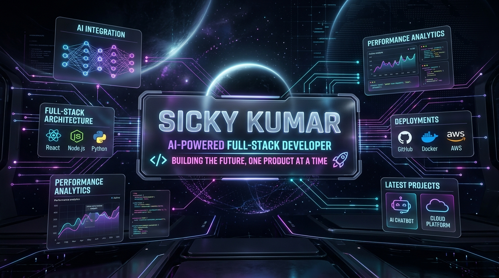
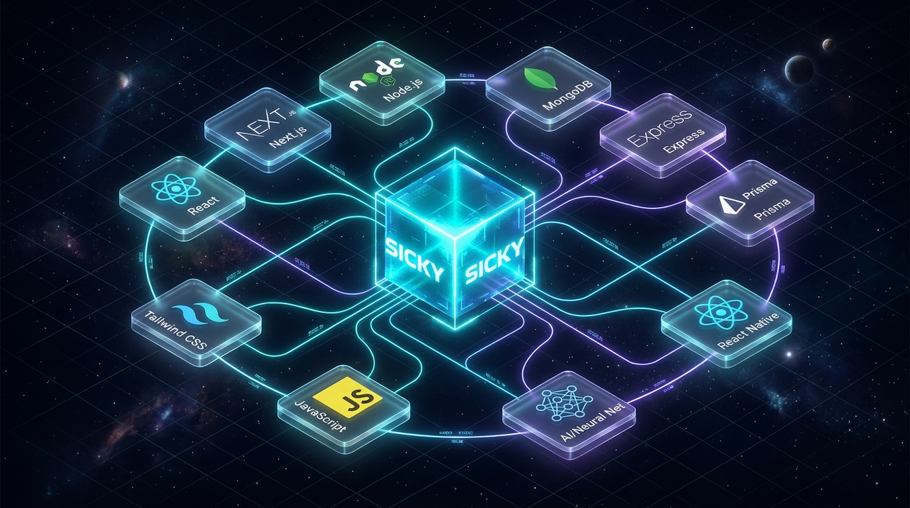
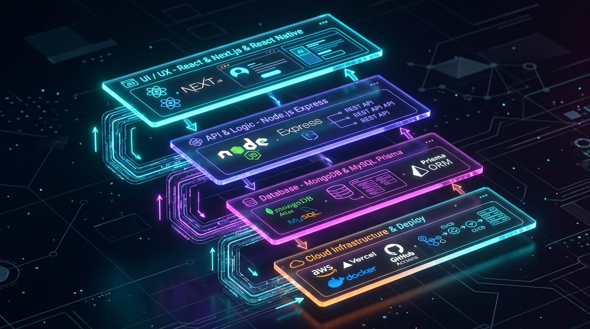
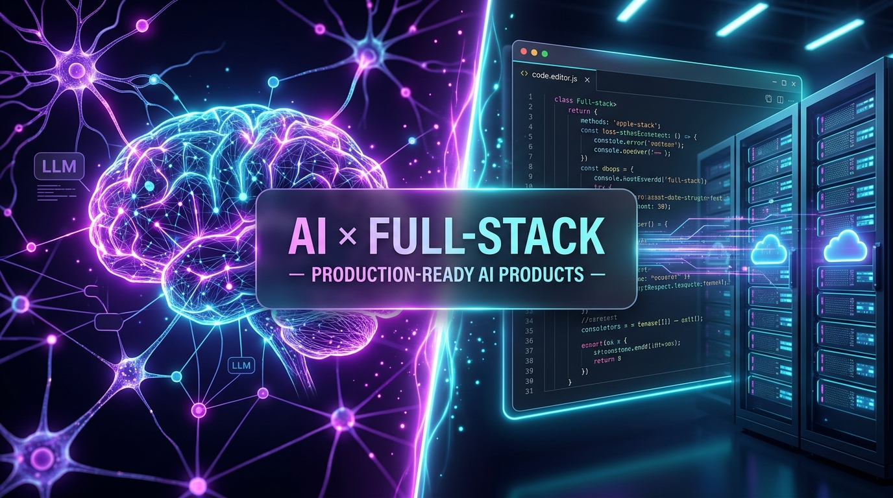

<div align="center">

  <!-- HERO BANNER -->
  <a href="https://www.sickykumar.in">
    
  </a>

  <br/><br/>

  <!-- ANIMATED TYPING SUBTITLE -->
  <a href="https://www.sickykumar.in">
    
  </a>

  <p align="center">
    <b>Building the future, one scalable digital product at a time.</b><br/>
    <i>Specialized in modern JavaScript ecosystems, production AI integrations, reactive frontends, and cloud architectures.</i>
  </p>

  <!-- SAAS CTA ACTION BUTTONS -->
  <p align="center">
    <a href="https://www.sickykumar.in">
      
    </a>
    <a href="https://www.linkedin.com/in/sickykumar/">
      
    </a>
    <a href="https://github.com/sickykumar?tab=repositories">
      
    </a>
    <a href="https://t.me/sicky9304s">
      
    </a>
    <a href="https://www.instagram.com/sicky9304s/">
      
    </a>
  </p>

</div>

---

<div align="center">

  <!-- REPO QUICK NAVIGATION BAR -->
  <table>
    <tr>
      <td align="center"><b><a href="#-featured-builds">⭐ FEATURED</a></b></td>
      <td align="center"><b><a href="#-web-applications">🌐 WEB (14)</a></b></td>
      <td align="center"><b><a href="#-ai-projects">🤖 AI APPS (5)</a></b></td>
      <td align="center"><b><a href="#%EF%B8%8F-desktop-applications">🖥️ DESKTOP (2)</a></b></td>
      <td align="center"><b><a href="#-data-analytics--dashboards">📊 ANALYTICS (5)</a></b></td>
      <td align="center"><b><a href="#%EF%B8%8F-backend--developer-tools">🛠️ TOOLS (3)</a></b></td>
      <td align="center"><b><a href="#-learning-systems--experiments">🧪 LABS (10)</a></b></td>
      <td align="center"><b><a href="https://github.com/sickykumar?tab=repositories">🔗 ALL (38) →</a></b></td>
    </tr>
  </table>

</div>

---

# 🌌 3D Technology Ecosystem

<div align="center">
  
  <p><i>Autonomous Node Architecture — Interactive multi-stack integration with AI core orchestrator</i></p>
</div>

---

# ⚡ My Technology Universe

<table width="100%">
  <tr>
    <td width="50%" valign="top">
      <h3>🎨 Frontend Engineering</h3>
      <p>
        
        
        
        <br/>
        
        
        
        <br/>
        
        
        
      </p>
    </td>
    <td width="50%" valign="top">
      <h3>⚙️ Backend & APIs</h3>
      <p>
        
        
        
        <br/>
        
        
        
      </p>
    </td>
  </tr>
  <tr>
    <td width="50%" valign="top">
      <h3>💾 Database & ORM</h3>
      <p>
        
        
        <br/>
        
        
      </p>
    </td>
    <td width="50%" valign="top">
      <h3>🤖 AI & Intelligence</h3>
      <p>
        
        
        <br/>
        
        
      </p>
    </td>
  </tr>
  <tr>
    <td width="50%" valign="top">
      <h3>📱 Mobile & Desktop</h3>
      <p>
        
        
        
        <br/>
        
      </p>
    </td>
    <td width="50%" valign="top">
      <h3>☁️ Cloud & Infrastructure</h3>
      <p>
        
        
        
        <br/>
        
        
        
      </p>
    </td>
  </tr>
</table>

---

# 🏗️ Full-Stack 3D Architecture Pipeline

<div align="center">
  
</div>

```
                    ┌────────────────────────────────────────────────┐
                    │               🤖 AI AGENTS & LLMs              │
                    └───────────────────────┬────────────────────────┘
                                            │
           ┌────────────────────────────────┼────────────────────────────────┐
           ▼                                ▼                                ▼
    🌐 WEB CLIENT                   📱 MOBILE APP                   🖥️ DESKTOP CLIENT
  (React / Next.js / Vite)         (React Native / Expo)               (Electron / React)
           │                                │                                │
           └────────────────────────────────┼────────────────────────────────┘
                                            ▼
                           ⚙️ HIGH PERFORMANCE API GATEWAY
                              (Node.js / Express REST API)
                                            │
                     ┌──────────────────────┴──────────────────────┐
                     ▼                                             ▼
            🍃 DOCUMENT STORAGE                           🐬 RELATIONAL DATABASE
            (MongoDB + Mongoose)                             (MySQL + Prisma ORM)
                     │                                             │
                     └──────────────────────┬──────────────────────┘
                                            ▼
                               ☁️ DEPLOYED CLOUD FABRIC
                         (AWS / Vercel / Render / Cloudinary)
```

---

# ⭐ Featured Builds

<table width="100%">
  <tr>
    <td width="50%" valign="top">
      <h3>🎓 <a href="https://github.com/sickykumar/e-learning-platform">e-learning-platform</a></h3>
      <p><b>Full-Stack MERN SaaS Education Engine</b></p>
      <p>Comprehensive MERN e-learning system with student/instructor portals, JWT authentication, course lifecycle management, certificate generation, secure payment checkout, and admin analytics.</p>
      <p>
        <code>React</code> · <code>Node.js</code> · <code>Express</code> · <code>MongoDB</code> · <code>Tailwind</code>
      </p>
      <a href="https://github.com/sickykumar/e-learning-platform">
        
      </a>
    </td>
    <td width="50%" valign="top">
      <h3>🌾 <a href="https://github.com/sickykumar/agriconnect">agriconnect</a></h3>
      <p><b>AgriTech Ecosystem & Marketplace</b></p>
      <p>Modern digital platform empowering farmers and consumers through real-time marketplace interaction, resource optimization, transparent pricing, and supply chain connectivity.</p>
      <p>
        <code>React</code> · <code>Node.js</code> · <code>REST API</code> · <code>MongoDB</code> · <code>Cloud</code>
      </p>
      <a href="https://github.com/sickykumar/agriconnect">
        
      </a>
    </td>
  </tr>
  <tr>
    <td width="50%" valign="top">
      <h3>🎬 <a href="https://github.com/sickykumar/online-ott-platform">online-ott-platform</a></h3>
      <p><b>High-Scale Digital Streaming Experience</b></p>
      <p>Rich video streaming platform featuring dynamic category feeds, watchlist curation, high-performance media delivery, responsive glassmorphism UI, and optimized asset streaming.</p>
      <p>
        <code>React</code> · <code>JavaScript</code> · <code>Node.js</code> · <code>Cloudinary</code> · <code>CSS3</code>
      </p>
      <a href="https://github.com/sickykumar/online-ott-platform">
        
      </a>
    </td>
    <td width="50%" valign="top">
      <h3>🤖 <a href="https://github.com/sickykumar/ai-powered-food-app">ai-powered-food-app</a></h3>
      <p><b>Smart AI Culinary & Recipe Intelligence</b></p>
      <p>AI-infused dining and cooking companion that utilizes machine learning and LLM prompts for personalized nutritional guidance, automated recipe synthesis, and intelligent ingredient tracking.</p>
      <p>
        <code>React</code> · <code>AI Integration</code> · <code>Node.js</code> · <code>REST APIs</code>
      </p>
      <a href="https://github.com/sickykumar/ai-powered-food-app">
        
      </a>
    </td>
  </tr>
  <tr>
    <td width="50%" valign="top">
      <h3>📰 <a href="https://github.com/sickykumar/News-Web-Application">News-Web-Application</a></h3>
      <p><b>Real-Time Live Global News Portal</b></p>
      <p>Dynamic news portal with instant category filtering, real-time live REST API consumption, multi-topic searches, reactive responsive UI, and lightning-fast article feeds.</p>
      <p>
        <code>React.js</code> · <code>Live News API</code> · <code>JavaScript</code> · <code>Tailwind</code>
      </p>
      <a href="https://github.com/sickykumar/News-Web-Application">
        
      </a>
    </td>
    <td width="50%" valign="top">
      <h3>💼 <a href="https://github.com/sickykumar/main-portfolio">main-portfolio</a></h3>
      <p><b>Interactive Flagship SaaS Developer Portfolio</b></p>
      <p>Next-gen developer showcase built with micro-interactions, responsive 3D layouts, automated project discovery, dark mode palettes, and optimized lighthouse performance.</p>
      <p>
        <code>React</code> · <code>Vite</code> · <code>Tailwind CSS</code> · <code>Framer Motion</code>
      </p>
      <a href="https://github.com/sickykumar/main-portfolio">
        
      </a>
    </td>
  </tr>
</table>

---

# 🚀 My Repository Universe

> Discover every public project built by **Sicky Kumar** across Web, AI, Desktop, Data Analytics, Tools, and Systems.

<details open>
<summary><h3>🌐 Web Applications (14 Repositories)</h3></summary>

| Project | Description | Technology Stack | Quick Link |
| :--- | :--- | :--- | :--- |
| 🎓 **[e-learning-platform](https://github.com/sickykumar/e-learning-platform)** | Full-stack MERN e-learning platform with certificates, payments & admin | `React` `Node.js` `Express` `MongoDB` | [**View Repo →**](https://github.com/sickykumar/e-learning-platform) |
| 🌾 **[agriconnect](https://github.com/sickykumar/agriconnect)** | Agriculture smart marketplace and ecosystem hub | `React` `Node.js` `REST API` | [**View Repo →**](https://github.com/sickykumar/agriconnect) |
| 🎬 **[online-ott-platform](https://github.com/sickykumar/online-ott-platform)** | Online streaming platform with video catalog feeds | `React` `JavaScript` `Node.js` | [**View Repo →**](https://github.com/sickykumar/online-ott-platform) |
| 📰 **[News-Web-Application](https://github.com/sickykumar/News-Web-Application)** | Live news aggregation web application with multi-category search | `React` `News API` `JavaScript` | [**View Repo →**](https://github.com/sickykumar/News-Web-Application) |
| 💼 **[main-portfolio](https://github.com/sickykumar/main-portfolio)** | Flagship developer portfolio website with interactive UI | `React` `Vite` `Tailwind` | [**View Repo →**](https://github.com/sickykumar/main-portfolio) |
| 🎨 **[react-worldArt-project](https://github.com/sickykumar/react-worldArt-project)** | Dynamic art showcase and global creative gallery | `React` `CSS Modules` `JavaScript` | [**View Repo →**](https://github.com/sickykumar/react-worldArt-project) |
| ✅ **[react-Todo-app](https://github.com/sickykumar/react-Todo-app)** | Persistent state task management application with localStorage | `React` `State Hooks` `Storage` | [**View Repo →**](https://github.com/sickykumar/react-Todo-app) |
| 🌓 **[dark-light-mode-react](https://github.com/sickykumar/dark-light-mode-react)** | Seamless theme toggling and design token implementation in React | `React` `Theme Context` `CSS` | [**View Repo →**](https://github.com/sickykumar/dark-light-mode-react) |
| ⚡ **[pokemon-search-app](https://github.com/sickykumar/pokemon-search-app)** | Fast Pokémon database explorer with live REST search | `JavaScript` `PokéAPI` `HTML5/CSS3` | [**View Repo →**](https://github.com/sickykumar/pokemon-search-app) |
| 🧮 **[Modern-Calculator](https://github.com/sickykumar/Modern-Calculator)** | Clean glassmorphism modern scientific calculator | `JavaScript` `CSS3` `HTML5` | [**View Repo →**](https://github.com/sickykumar/Modern-Calculator) |
| 📚 **[eduhub_web](https://github.com/sickykumar/eduhub_web)** | Educational resource library and student platform | `HTML5` `CSS3` `JavaScript` | [**View Repo →**](https://github.com/sickykumar/eduhub_web) |
| 🎨 **[gradient-color-picker](https://github.com/sickykumar/gradient-color-picker)** | Interactive CSS gradient generator and developer palette tool | `JavaScript` `CSS3 Canvas` | [**View Repo →**](https://github.com/sickykumar/gradient-color-picker) |
| 🔗 **[url_shortner](https://github.com/sickykumar/url_shortner)** | Backend URL shortener and redirect analytics service | `Node.js` `Express` `MongoDB` | [**View Repo →**](https://github.com/sickykumar/url_shortner) |
| 💼 **[Portfolio_With_AI](https://github.com/sickykumar/Portfolio_With_AI)** | AI-enhanced interactive portfolio prototype | `React` `AI API` `JavaScript` | [**View Repo →**](https://github.com/sickykumar/Portfolio_With_AI) |

</details>

<details open>
<summary><h3>🤖 AI Projects (5 Repositories)</h3></summary>

| Project | Description | Technology Stack | Quick Link |
| :--- | :--- | :--- | :--- |
| 🍕 **[ai-powered-food-app](https://github.com/sickykumar/ai-powered-food-app)** | AI-assisted recipe engine and intelligent food discovery | `React` `AI API` `Node.js` | [**View Repo →**](https://github.com/sickykumar/ai-powered-food-app) |
| 💬 **[Ai-Chat-Bot-Pro](https://github.com/sickykumar/Ai-Chat-Bot-Pro)** | Advanced AI conversational assistant with context preservation | `Python` `AI / LLM` `NLP` | [**View Repo →**](https://github.com/sickykumar/Ai-Chat-Bot-Pro) |
| ♊ **[ChatBot-Google-Gemini](https://github.com/sickykumar/ChatBot-Google-Gemini)** | Intelligent conversational application powered by Google Gemini API | `Google Gemini API` `Python` `Node` | [**View Repo →**](https://github.com/sickykumar/ChatBot-Google-Gemini) |
| 🤖 **[chatbot](https://github.com/sickykumar/chatbot)** | Core AI chatbot application and conversational engine | `JavaScript` `AI Logic` | [**View Repo →**](https://github.com/sickykumar/chatbot) |
| 🧠 **[Portfolio_With_AI](https://github.com/sickykumar/Portfolio_With_AI)** | AI-powered personal portfolio interface | `React` `AI API` `Full-Stack` | [**View Repo →**](https://github.com/sickykumar/Portfolio_With_AI) |

</details>

<details open>
<summary><h3>🖥️ Desktop Applications (2 Repositories)</h3></summary>

| Project | Description | Technology Stack | Quick Link |
| :--- | :--- | :--- | :--- |
| 🎵 **[windows-music-player](https://github.com/sickykumar/windows-music-player)** | Native desktop audio player with playlist management and visualizer | `Electron` `React` `Desktop API` | [**View Repo →**](https://github.com/sickykumar/windows-music-player) |
| 🎧 **[offline-music-player](https://github.com/sickykumar/offline-music-player)** | Standalone offline music jukebox with local file indexing | `Electron / JS` `Audio Engine` | [**View Repo →**](https://github.com/sickykumar/offline-music-player) |

</details>

<details open>
<summary><h3>📊 Data Analytics & Dashboards (5 Repositories)</h3></summary>

| Project | Description | Technology Stack | Quick Link |
| :--- | :--- | :--- | :--- |
| 📈 **[ALEX-ECOMMERCE-SALES-DASHBOARD](https://github.com/sickykumar/ALEX-ECOMMERCE-SALES-DASHBOARD)** | Multi-channel e-commerce revenue analytics and KPI dashboard | `PowerBI / Excel` `Data Analytics` | [**View Repo →**](https://github.com/sickykumar/ALEX-ECOMMERCE-SALES-DASHBOARD) |
| 🛒 **[SuperStore_Sales_Report](https://github.com/sickykumar/SuperStore_Sales_Report)** | Comprehensive retail store analytics and profit distribution report | `Business Intelligence` `Analytics` | [**View Repo →**](https://github.com/sickykumar/SuperStore_Sales_Report) |
| 🏢 **[Sales-Dashboard-Of-ABC-Company](https://github.com/sickykumar/Sales-Dashboard-Of-ABC-Company)** | Corporate enterprise sales performance and forecasting metrics | `Data Analytics` `Visual Dashboards` | [**View Repo →**](https://github.com/sickykumar/Sales-Dashboard-Of-ABC-Company) |
| 👥 **[HR-ANALYTICS-PROJECT](https://github.com/sickykumar/HR-ANALYTICS-PROJECT)** | Workforce attrition, retention, and HR performance insights | `Analytics` `KPI Reporting` | [**View Repo →**](https://github.com/sickykumar/HR-ANALYTICS-PROJECT) |
| 📺 **[Amazon-Prime-Movies-and-TV-Shows](https://github.com/sickykumar/Amazon-Prime-Movies-and-TV-Shows)** | Streaming platform catalog exploratory data analysis and visual trends | `Data Analysis` `Python / Excel` | [**View Repo →**](https://github.com/sickykumar/Amazon-Prime-Movies-and-TV-Shows) |

</details>

<details open>
<summary><h3>🛠️ Backend & Developer Tools (3 Repositories)</h3></summary>

| Project | Description | Technology Stack | Quick Link |
| :--- | :--- | :--- | :--- |
| 📦 **[NodeJs](https://github.com/sickykumar/NodeJs)** | Comprehensive collection of modular Node.js backend projects | `Node.js` `Express` `APIs` `Modules` | [**View Repo →**](https://github.com/sickykumar/NodeJs) |
| ⌨️ **[nodejs_cli_todo_app](https://github.com/sickykumar/nodejs_cli_todo_app)** | Interactive terminal CLI productivity tool for task management | `Node.js CLI` `Commander` `Inquirer` | [**View Repo →**](https://github.com/sickykumar/nodejs_cli_todo_app) |
| 🏫 **[student-management-system](https://github.com/sickykumar/student-management-system)** | Academic records and student administrative management system | `Full-Stack` `Database` `Node/Python` | [**View Repo →**](https://github.com/sickykumar/student-management-system) |

</details>

<details open>
<summary><h3>🧪 Learning, Systems & Experiments (10 Repositories)</h3></summary>

| Project | Description | Technology Stack | Quick Link |
| :--- | :--- | :--- | :--- |
| 🐍 **[Python_Tutorial](https://github.com/sickykumar/Python_Tutorial)** | Structured Python mastery modules from fundamentals to OOP | `Python 3` `Algorithms` `Exercises` | [**View Repo →**](https://github.com/sickykumar/Python_Tutorial) |
| 🟢 **[NodeJs_Tutorial](https://github.com/sickykumar/NodeJs_Tutorial)** | Backend architecture guides and async JavaScript patterns | `Node.js` `Event Loop` `Streams` | [**View Repo →**](https://github.com/sickykumar/NodeJs_Tutorial) |
| ⚡ **[DSA_With_C](https://github.com/sickykumar/DSA_With_C)** | Data structures & algorithms implemented in low-level C | `C Language` `Pointers` `Data Structures` | [**View Repo →**](https://github.com/sickykumar/DSA_With_C) |
| 🛠️ **[python_project](https://github.com/sickykumar/python_project)** | Python utility scripts for file conversions, network & system tools | `Python Utilities` `Automation` | [**View Repo →**](https://github.com/sickykumar/python_project) |
| 🍃 **[MongoDB_With_Python](https://github.com/sickykumar/MongoDB_With_Python)** | PyMongo integration and database aggregation pipelines | `Python` `MongoDB` `PyMongo` | [**View Repo →**](https://github.com/sickykumar/MongoDB_With_Python) |
| 📹 **[YouTube-Video-Manager-with-MongoDB-in-Python](https://github.com/sickykumar/YouTube-Video-Manager-with-MongoDB-in-Python)** | Video inventory management with Python & MongoDB CRUD operations | `Python` `MongoDB` `CLI / Backend` | [**View Repo →**](https://github.com/sickykumar/YouTube-Video-Manager-with-MongoDB-in-Python) |
| 📇 **[Contact-Management-System-with-Python](https://github.com/sickykumar/Contact-Management-System-with-Python)** | Relational contact registry with persistent file and database storage | `Python` `File I/O` `Database` | [**View Repo →**](https://github.com/sickykumar/Contact-Management-System-with-Python) |
| ☁️ **[aws-demo-app](https://github.com/sickykumar/aws-demo-app)** | Cloud deployment architecture and AWS cloud service experiments | `AWS` `Cloud Hosting` `DevOps` | [**View Repo →**](https://github.com/sickykumar/aws-demo-app) |
| 🏢 **[ardent-internship](https://github.com/sickykumar/ardent-internship)** | Production industry internship project and software development deliverables | `Full-Stack Development` `Industry Tasks` | [**View Repo →**](https://github.com/sickykumar/ardent-internship) |
| 🌐 **[AWS-AS](https://github.com/sickykumar/AWS-AS)** | AWS infrastructure and cloud scalability project | `AWS` `Cloud Architecture` | [**View Repo →**](https://github.com/sickykumar/AWS-AS) |

</details>

<div align="center">
  <br/>
  <a href="https://github.com/sickykumar?tab=repositories">
    
  </a>
</div>

---

# 🧠 What I Build

<table width="100%">
  <tr>
    <td width="33%" valign="top">
      <h3>🚀 SaaS Platforms</h3>
      <p>Scalable, subscription-based applications with automated workflows, role-based authentication, and modern user experiences.</p>
    </td>
    <td width="33%" valign="top">
      <h3>🤖 AI Applications</h3>
      <p>Intelligent software powered by OpenAI & Gemini APIs, LLM prompt engineering, autonomous agents, and contextual AI workflows.</p>
    </td>
    <td width="33%" valign="top">
      <h3>🌐 Web Applications</h3>
      <p>High-performance, reactive full-stack web applications using React, Next.js, Vite, and production-grade MERN architectures.</p>
    </td>
  </tr>
  <tr>
    <td width="33%" valign="top">
      <h3>📱 Mobile Apps</h3>
      <p>Cross-platform mobile applications engineered with React Native, Expo, and Expo Router for iOS and Android.</p>
    </td>
    <td width="33%" valign="top">
      <h3>🛠️ Developer Tools</h3>
      <p>CLI utilities, reusable component libraries, starter scaffolds, and developer systems that boost engineering productivity.</p>
    </td>
    <td width="33%" valign="top">
      <h3>📊 Business Platforms</h3>
      <p>Enterprise analytics dashboards, LMS platforms, e-commerce engines, and data reporting command centers.</p>
    </td>
  </tr>
</table>

---

# 🤖 AI × Full-Stack Convergence

<div align="center">
  
</div>

<br/>

<div align="center">

```
  ┌───────────────┐     ┌────────────────┐     ┌───────────────────────┐     ┌─────────────────┐
  │   Modern UI   │  +  │ Scalable APIs  │  +  │ Database Architecture │  +  │ AI Integrations │
  └───────────────┘     └────────────────┘     └───────────────────────┘     └─────────────────┘
                                                  │
                                                  ▼
                                🚀 PRODUCTION-READY AI PRODUCTS
```

</div>

> **Bridging the gap between frontier AI capabilities and bulletproof full-stack execution.**
> I combine reactive frontend architectures and robust backend APIs with LLM integrations to turn complex AI ideas into intuitive, production-grade SaaS products.

---

# 📱 Mobile Engineering

<table width="100%">
  <tr>
    <td width="65%" valign="top">
      <h3>React Native + Expo Ecosystem</h3>
      <p>Mobile applications shouldn't be an afterthought. I engineer native cross-platform experiences that share business logic with web clients while respecting mobile design paradigms.</p>
      <ul>
        <li><b>Expo & Expo Router:</b> File-based native routing and deep linking</li>
        <li><b>State Synchronization:</b> Shared caching with TanStack Query and Redux</li>
        <li><b>Responsive Mobile UI:</b> Fluid layouts with Tailwind / NativeWind</li>
        <li><b>Secure Storage:</b> Biometrics, secure keychain auth, and offline mode</li>
      </ul>
    </td>
    <td width="35%" align="center" valign="middle">
      <br/><br/>
      <br/><br/>
      
    </td>
  </tr>
</table>

---

# 💎 Engineering Principles

<table>
  <tr>
    <td width="33%" valign="top">
      <h4><code>01</code> System Architecture</h4>
      <p>Build modular, loosely-coupled systems designed to adapt and scale as product requirements evolve.</p>
    </td>
    <td width="33%" valign="top">
      <h4><code>02</code> Extreme Performance</h4>
      <p>Optimize frontend rendering, minimize API latency, and craft efficient database queries with indexing.</p>
    </td>
    <td width="33%" valign="top">
      <h4><code>03</code> Bulletproof Security</h4>
      <p>End-to-end data validation, JWT authentication, role authorization, and sanitized API endpoints.</p>
    </td>
  </tr>
  <tr>
    <td width="33%" valign="top">
      <h4><code>04</code> High Scalability</h4>
      <p>Architect state layers, microservices, and databases for rapid growth without technical debt.</p>
    </td>
    <td width="33%" valign="top">
      <h4><code>05</code> Intuitive UX</h4>
      <p>Transform complicated backend workflows and AI pipelines into effortless, delightful user interfaces.</p>
    </td>
    <td width="33%" valign="top">
      <h4><code>06</code> Value-Driven AI</h4>
      <p>Integrate AI where it genuinely improves user speed, automation, and core product metrics.</p>
    </td>
  </tr>
</table>

---

# 📊 Building in Public & Analytics

<div align="center">

  <!-- GITHUB STATS & STREAK CARDS -->
  <table border="0">
    <tr>
      <td align="center" valign="middle">
        <a href="https://github.com/sickykumar">
          
        </a>
      </td>
      <td align="center" valign="middle">
        <a href="https://github.com/sickykumar">
          
        </a>
      </td>
    </tr>
    <tr>
      <td colspan="2" align="center">
        <a href="https://github.com/sickykumar">
          
        </a>
      </td>
    </tr>
  </table>

  <p><i>"Every commit is another step toward engineering a better digital product."</i></p>

</div>

---

# 🔭 Currently Exploring & Expanding

<div align="center">
  <p>
    
    
    
    <br/>
    
    
    
  </p>
</div>

---

# ⚡ Personal Identity

<div align="center">

```text
   ███████╗██╗ ██████╗██╗  ██╗██╗   ██╗    ██╗  ██╗██╗   ██╗███╗   ███╗ █████╗ ██████╗ 
   ██╔════╝██║██╔════╝██║ ██╔╝╚██╗ ██╔╝    ██║ ██╔╝██║   ██║████╗ ████║██╔══██╗██╔══██╗
   ███████╗██║██║     █████═╝  ╚████╔╝     █████═╝ ██║   ██║██╔████╔██║███████║██████╔╝
   ╚════██║██║██║     ██╔═██╗   ╚██╔╝      ██╔═██╗ ██║   ██║██║╚██╔╝██║██╔══██║██╔══██╗
   ███████║██║╚██████╗██║  ██╗   ██║       ██║  ██╗╚██████╔╝██║ ╚═╝ ██║██║  ██║██║  ██║
   ╚══════╝╚═╝ ╚═════╝╚═╝  ╚═╝   ╚═╝       ╚═╝  ╚═╝ ╚═════╝ ╚═╝     ╚═╝╚═╝  ╚═╝╚═╝  ╚═╝
```

**Sicky Kumar** · *Developer · Builder · Problem Solver*  
**JavaScript-First · AI-Powered · Product-Focused**

</div>

---

<div align="center">

  # ✨ Have a Vision or Project?

  ### **Let's build something remarkable together.**

  <p>
    Whether you are looking to hire a full-stack engineer, build an AI SaaS product, or collaborate on innovative projects:
  </p>

  <p>
    <a href="https://www.sickykumar.in">
      
    </a>
    <a href="https://www.linkedin.com/in/sickykumar/">
      
    </a>
    <a href="https://t.me/sicky9304s">
      
    </a>
    <a href="https://www.instagram.com/sicky9304s/">
      
    </a>
  </p>

  <br/>

  <sub>
    Built with React, Node.js, AI & curiosity · © 2026 <b>Sicky Kumar</b>. All rights reserved.
  </sub>

</div>
